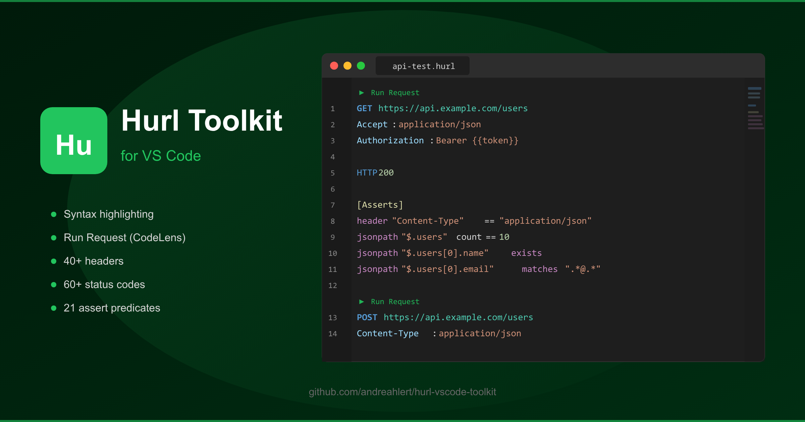
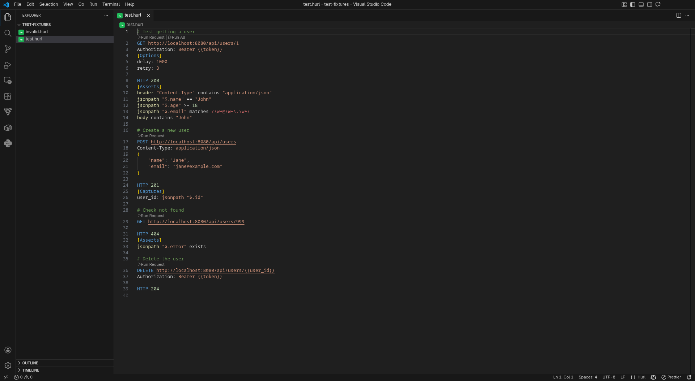
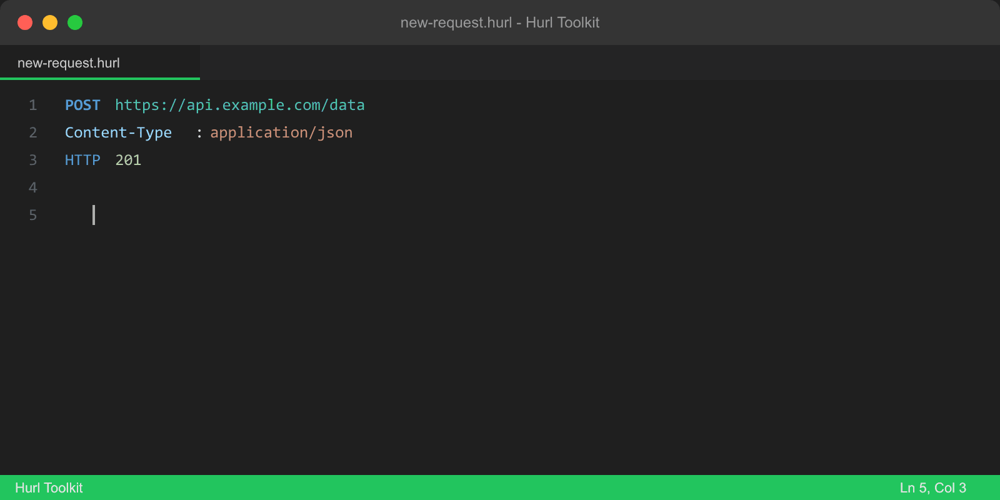
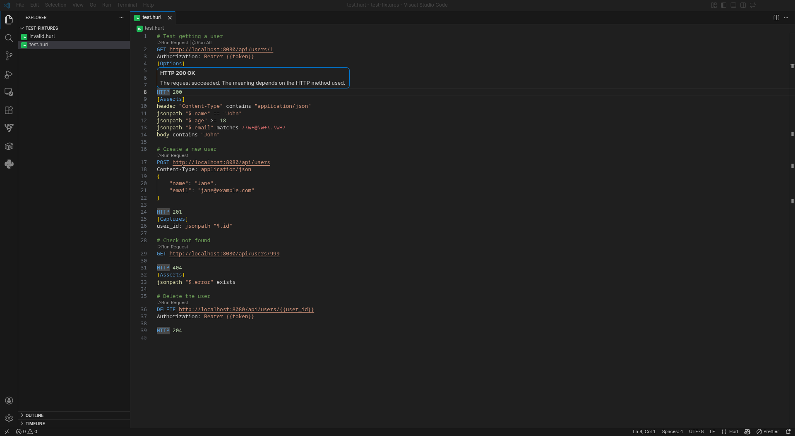
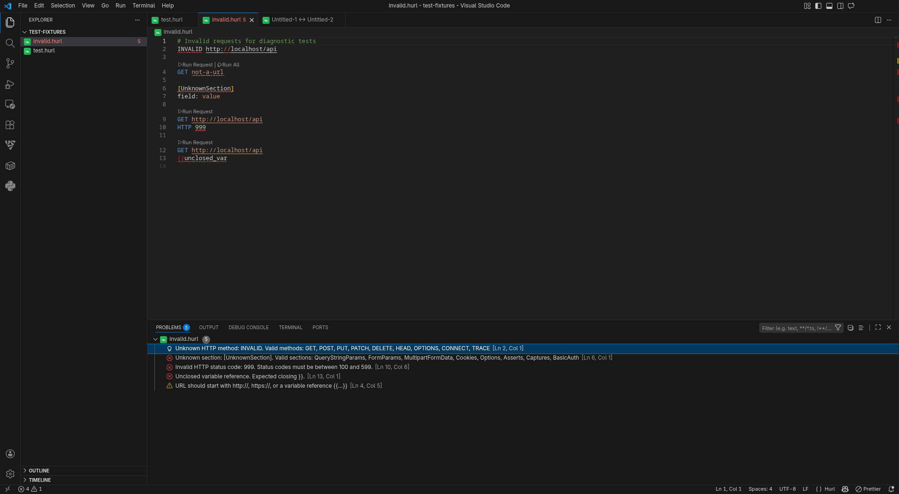

<p align="center">
  
</p>

<p align="center">
  <a href="https://marketplace.visualstudio.com/items?itemName=atoolz.hurl-vscode-toolkit"></a>
  <a href="https://marketplace.visualstudio.com/items?itemName=atoolz.hurl-vscode-toolkit"></a>
  <a href="https://marketplace.visualstudio.com/items?itemName=atoolz.hurl-vscode-toolkit"></a>
  <a href="https://opensource.org/licenses/MIT"></a>
  <a href="https://hurl.dev"></a>
</p>

<p align="center">
  Complete <a href="https://hurl.dev">Hurl</a> HTTP testing toolkit for VS Code. Syntax highlighting, run requests, response viewer, and IntelliSense for <code>.hurl</code> files.
</p>

## Features

### Syntax Highlighting

Full TextMate grammar for `.hurl` files with support for HTTP methods, URLs, headers, status codes, sections, variables, embedded JSON/XML/GraphQL, assert predicates, filter functions, and more.

<p align="center">
  
</p>

### Run Requests (CodeLens)

Click **Run Request** above any HTTP method to execute it with `hurl`. Click **Run All** to execute every request in the file. Output is displayed in a dedicated output channel, with an optional webview panel for formatted responses.

### IntelliSense

Context-aware completions for:

- HTTP methods (GET, POST, PUT, PATCH, DELETE, HEAD, OPTIONS, CONNECT, TRACE)
- Common HTTP headers with value suggestions (Content-Type, Authorization, Accept, etc.)
- Section names ([Asserts], [Captures], [Options], [FormParams], etc.)
- HTTP status codes with descriptions (200 OK, 404 Not Found, 500 Internal Server Error, etc.)
- Assert predicates (==, !=, >, contains, matches, exists, isString, etc.)
- Filter functions (count, jsonpath, regex, replace, split, toInt, etc.)
- Options (delay, retry, location, insecure, verbose, etc.)
- Variable references ({{variable}}) from captures and usage



### Hover Documentation

Hover over any keyword to see documentation. Methods, status codes, sections, options, assert predicates, filter functions, and headers all provide contextual information.

<p align="center">
  
</p>

### Diagnostics

Real-time error detection for:

- Invalid HTTP methods
- Malformed URLs
- Unknown section names
- Invalid status codes (outside 100-599 range)
- Unclosed variable references `{{`

<p align="center">
  
</p>

### Snippets

9 built-in snippets for common Hurl patterns:

| Prefix | Description |
|---|---|
| `hurl-get` | GET request with assertions |
| `hurl-post-json` | POST with JSON body |
| `hurl-post-form` | POST with form parameters |
| `hurl-auth` | Request with Bearer authentication |
| `hurl-graphql` | GraphQL request |
| `hurl-upload` | Multipart file upload |
| `hurl-capture` | Request with response captures |
| `hurl-chain` | Chained requests (create, read, delete) |
| `hurl-full` | Complete CRUD test template |

## Requirements

- [Hurl](https://hurl.dev/docs/installation.html) installed and available in your PATH (or configured via settings)

## Extension Settings

| Setting | Default | Description |
|---|---|---|
| `hurl-toolkit.hurlPath` | `"hurl"` | Path to the hurl executable |
| `hurl-toolkit.showResponseInWebview` | `false` | Show responses in a webview panel |
| `hurl-toolkit.additionalArguments` | `""` | Extra arguments passed to hurl |
| `hurl-toolkit.variablesFile` | `""` | Path to a `--variables-file` for hurl |

## About Hurl

[Hurl](https://hurl.dev) is a command-line tool that runs HTTP requests defined in a simple plain text format. It can perform requests, capture values, and evaluate queries on headers and body response. Hurl is very versatile: it can be used for fetching data, testing HTTP sessions, and testing APIs.

## Contributing

```bash
git clone https://github.com/atoolz/hurl-vscode-toolkit.git
cd hurl-vscode-toolkit
npm install
npm run build
npm run test:e2e
# Press F5 in VS Code to debug
```

Contributions welcome! See the [AToolZ Contributing Guide](https://github.com/atoolz/.github/blob/main/CONTRIBUTING.md).

## License

[MIT](LICENSE)

<p align="center"><sub>Part of the <a href="https://github.com/atoolz">AToolZ</a> toolkit suite</sub></p>
